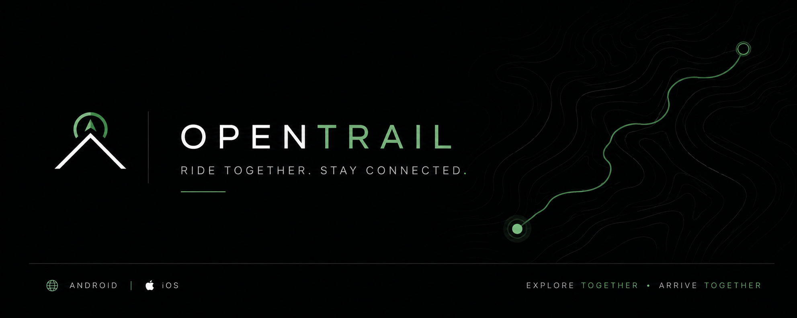
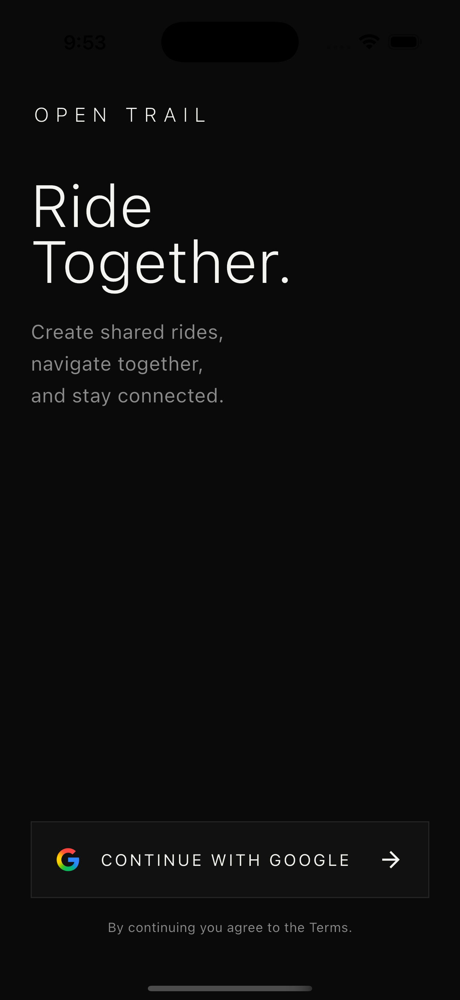
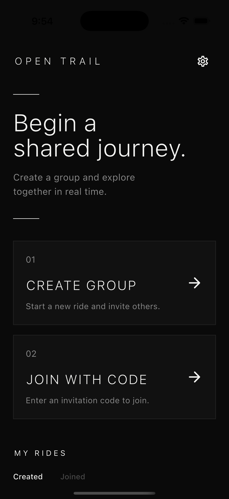
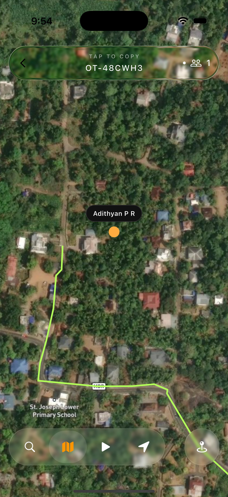

<div align="center">

# OpenTrail

<p align="center">
  
</p>

**Real-time convoy tracking and navigation for motorcycle and cycling groups.**

<p>
  
  
  
  
</p>

</div>

---

## Overview

OpenTrail is a Flutter application built for coordinating motorcycle and cycling group rides. It enables riders to share live locations, navigate to a common destination, and stay connected throughout the ride.

## Features

- Live rider tracking
- Group ride management
- Shared destination navigation
- Interactive map
- Firebase Authentication
- Cloud Firestore synchronization

## Tech Stack

- Flutter
- Dart
- Firebase Authentication
- Cloud Firestore
- Flutter Map
- OpenRouteService
- Geolocator

## Getting Started

Clone the repository.

```bash
git clone https://github.com/<your-username>/OpenTrail.git
cd OpenTrail
```

Install dependencies.

```bash
flutter pub get
```

Create a `.env` file.

```env
MAPBOX_ACCESS_TOKEN=YOUR_MAPBOX_TOKEN
ORS_API_KEY=YOUR_ORS_API_KEY
```

Run the application.

```bash
flutter run
```

## Project Structure

```
lib/
├── core/
├── features/
├── models/
├── services/
├── widgets/
└── main.dart
```

## Screenshots

<div align="center">

| Login | Home | Navigation |
|------|------|------------|
|  |  |  |

</div>

---

<div align="center">

Made with ❤️ using Flutter & Firebase

</div>
